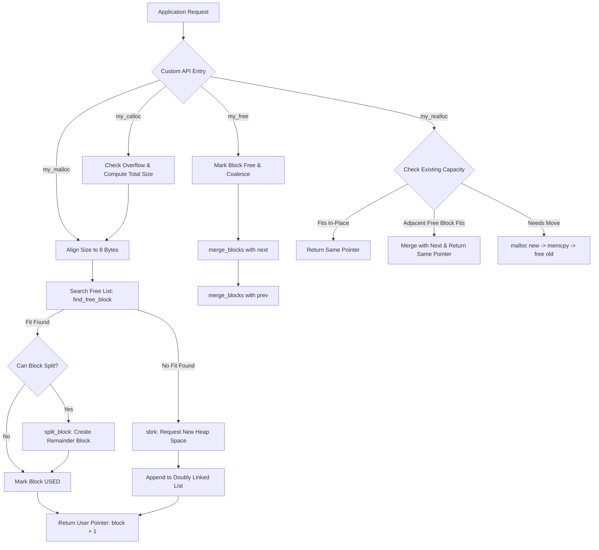

# Custom Memory Allocator

A lightweight, explicit, and deterministic dynamic memory allocator implemented in C. This project implements core user-space memory management routines—analogous to the standard C library's `malloc`, `free`, `calloc`, and `realloc`—built directly on top of the POSIX `sbrk` system call.

---

## 1. Overview

In systems programming, dynamic memory allocation allows software to request memory at runtime when variable sizes or lifetimes cannot be determined at compile time. While high-level languages rely on garbage collection and standard C programs rely on `glibc`'s `ptmalloc`, understanding the underlying mechanics of memory management is fundamental to computer systems and software engineering.

The primary responsibilities of a heap allocator are:
- Requesting raw virtual memory from the operating system kernel via low-level primitives (such as `brk`/`sbrk`).
- Tracking allocated and free regions within the process's heap segment.
- Minimizing memory fragmentation (both internal and external).
- Providing predictable and fast allocation and deallocation operations.

This project implements a simplified, educational, yet functional dynamic memory allocator that replaces the standard C memory management routines. It demonstrates how block metadata headers, doubly linked lists, first-fit searching, block splitting, and bidirectional coalescing operate together to manage memory using fundamental allocation strategies.

---

## 2. Features Implemented

The allocator provides the following features based strictly on the codebase implementation:

- **Custom `malloc` Implementation (`my_malloc`)**: Allocates aligned blocks of memory on the heap, reusing existing free blocks or requesting new space via `sbrk`.
- **Custom `free` Implementation (`my_free`)**: Deallocates previously allocated blocks and immediately merges adjacent free chunks.
- **First Fit Allocation Strategy**: Traverses the block list from the head and selects the first free block large enough to satisfy the request.
- **Block Metadata Management**: Intrusive block headers track payload size, free/used status, and doubly linked list pointers.
- **Doubly Linked List Tracking**: Allows $O(1)$ access to neighboring blocks during coalescing
- **Block Splitting**: Divides oversized free blocks into an allocated block and a remainder free block to combat internal fragmentation.
- **Block Coalescing**: Merges adjacent free memory blocks upon deallocation to combat external fragmentation.
- **Memory Reuse**: Recycles freed blocks across subsequent allocation cycles without unnecessary heap expansions.
- **Custom `calloc` Implementation (`my_calloc`)**: Allocates zero-initialized memory with integrated integer multiplication overflow detection.
- **Custom `realloc` Implementation (`my_realloc`)**: Resizes existing allocations with basic optimizations.
- **In-Place `realloc` Expansion**: Checks if the current block already satisfies the requested size or merges with an adjacent free block to prevent unnecessary data copying.
- **Memory Alignment**: Enforces 8-byte payload alignment using bitwise masking.
- **Heap Debugging Utility (`print_heap`)**: Diagnostic routine that prints the state of all blocks, addresses, sizes, and linked list pointers.
- **Modular Test Suite**: Modular test suite verifying allocation, deallocation, block splitting, coalescing, calloc, and realloc behaviors.

---

## 3. Architecture

The allocator sits between user-level application logic and the operating system kernel. When the application requests memory, the allocator first searches its existing managed heap pool before invoking system calls to expand the data segment.

### Component Flow

```
+-----------------------------------------------------------+
|                    Application Code                       |
+-----------------------------------------------------------+
                              |
                              v
+-----------------------------------------------------------+
|                 Custom Allocation APIs                    |
|        my_malloc()  my_free()  my_calloc()  my_realloc()   |
+-----------------------------------------------------------+
                              |
                              v
+-----------------------------------------------------------+
|                     Block Manager                         |
|     align_size()   find_free_block()   split_block()      |
|                    merge_blocks()                         |
+-----------------------------------------------------------+
                              |
                              v
+-----------------------------------------------------------+
|              Doubly Linked Block List (Heap)              |
|        [Block 1] <---> [Block 2] <---> [Block 3]          |
+-----------------------------------------------------------+
                              |
                     (If no fit found)
                              v
+-----------------------------------------------------------+
|               OS Kernel Interface (sbrk)                  |
|                   Expands Program Break                   |
+-----------------------------------------------------------+
```

### Architectural State Diagram



---

## 4. Memory Block Structure

Every memory chunk managed by the allocator contains an intrusive metadata header preceding the user payload. The header is defined in `include/allocator.h`:

```c
struct block {
    size_t size;         /* Usable payload size in bytes (excluding header) */
    int free;            /* Allocation status: 1 = FREE, 0 = USED */
    struct block *next;  /* Pointer to the next block in the heap list */
    struct block *prev;  /* Pointer to the previous block in the heap list */
};
```

### Header Field Breakdown

| Field | Type | Description |
|---|---|---|
| `size` | `size_t` | The size (in bytes) of the usable memory payload reserved for the application. |
| `free` | `int` | Boolean flag indicating whether the block is currently free (`1`) or in use (`0`). |
| `next` | `struct block *` | Pointer to the next consecutive memory block in the heap chain (or `NULL` if tail). |
| `prev` | `struct block *` | Pointer to the preceding memory block in the heap chain (or `NULL` if head). |

### Why Metadata is Needed

Because the C runtime does not preserve allocation bounds or allocation states alongside raw memory pointers, the allocator must maintain book-keeping information inline. Storing metadata immediately prior to the user payload enables:
1. **$O(1)$ Header Lookup on Free**: Given a user pointer `ptr`, the allocator performs constant-time pointer arithmetic `(struct block *)ptr - 1` to retrieve the metadata header without searching through lists.
2. **Dynamic Splitting & Merging**: The allocator can accurately determine boundaries of adjacent blocks in physical memory to merge or divide chunks.
3. **Tracking Block Lifecycles**: Knowing which chunks are available enables recycling memory without repeatedly increasing the process heap size.

---

## 5. Memory Layout

All memory allocations are contiguous blocks containing the metadata structure directly followed by the payload memory returned to the caller.

### Physical Layout of a Block

```
+-------------------------------------------------------------+
|                     Memory Block Structure                  |
+------------------------------+------------------------------+
|        Metadata Header       |         User Payload         |
|      struct block (bytes)    |         size (bytes)         |
+------------------------------+------------------------------+
^                              ^
|                              |
block (Header Pointer)         ptr = (void *)(block + 1)
```

### Pointer Arithmetic and Header Relationship

When a user calls `my_malloc(size)`, the allocator locates or allocates a block of size `sizeof(struct block) + size`. The pointer returned to the caller points directly to the start of the payload:

```c
/* Converting from block metadata to user pointer */
void *user_ptr = (void *)(block + 1);
```

Because `block` is typed as `struct block *`, the expression `block + 1` advances the memory address by exactly `sizeof(struct block)` bytes.

When the user passes that pointer back to `my_free(ptr)` or `my_realloc(ptr, size)`:

```c
/* Recovering the block metadata from a user pointer */
struct block *block = (struct block *)ptr - 1;
```

Subtracting `1` shifts the address backward by `sizeof(struct block)` bytes, restoring access to the block's header fields (`size`, `free`, `next`, `prev`).

---

## 6. Allocation Strategy

The allocation routine `my_malloc(size_t size)` follows a deterministic 5-step lifecycle:

```
my_malloc(size)
  |
  +--> 1. Check size == 0? Return NULL.
  |
  +--> 2. Align size to 8-byte boundary: align_size(size)
  |
  +--> 3. Search heap: find_free_block(size) [First Fit]
  |       |
  |       +--> [MATCH FOUND]
  |       |      |
  |       |      +--> Can split? (block->size >= size + sizeof(struct block))
  |       |      |      +--> YES: split_block(block, size)
  |       |      |
  |       |      +--> Mark block->free = 0
  |       |      +--> Return (void *)(block + 1)
  |
  +--> 4. [NO MATCH FOUND]
          |
          +--> Request sbrk(size + sizeof(struct block))
          +--> Initialize header (size, free = 0, next = NULL)
          +--> Append to doubly linked list tail
          +--> Return (void *)(block + 1)
```

### Detailed Steps

1. **Alignment Calculation**:
   To prevent unaligned memory access penalties on modern processor architectures, requested sizes are aligned to 8-byte boundaries using bit manipulation:
   ```c
   #define ALIGNMENT 8

   size_t align_size(size_t size) {
       return (size + ALIGNMENT - 1) & ~(ALIGNMENT - 1);
   }
   ```
2. **First Fit Free Block Search**:
   The function `find_free_block(size)` performs a linear scan starting from `head`. It selects the first block satisfying both `current->free == 1` and `current->size >= size`.
3. **Memory Reuse**:
   If an existing free block fits the request, that block is reclaimed instead of requesting new memory from the operating system.
4. **Block Splitting**:
   If the reclaimed free block has excess capacity sufficient to hold both the requested size and a new `struct block` header, `split_block()` carves out the excess space into a new free block.
5. **Heap Expansion via `sbrk`**:
   If no suitable free block is found across the existing heap list, `sbrk(total_size)` is called to increment the program break. The new block is appended to the tail of the doubly linked list and returned.

---

## 7. Block Splitting

When an existing free block is significantly larger than the requested size, allocating the entire block creates **internal fragmentation** (wasted space within an allocated block). To eliminate this waste, the allocator splits the block.

### Splitting Condition

A block is eligible for splitting if and only if:
$$\text{block->size} \ge \text{requested\_size} + \text{sizeof(struct block)}$$

### Splitting Process

```
BEFORE SPLIT:
+-------------------------------------------------------------------------+
| Header (size = 500, free = 1) |               Payload (500 bytes)       |
+-------------------------------------------------------------------------+

AFTER SPLIT for size = 100:
+-----------------------+-------------+-----------------------+-----------+
| Header (size = 100)   | Payload 100 | Header (size = 368)   | Remainder |
| free = 0              | (Allocated) | free = 1              | (368 B)   |
+-----------------------+-------------+-----------------------+-----------+
^                                     ^
|                                     |
block                                 new_block = (char *)block + sizeof(header) + 100
```

### Pointer Management

The split operation carefully preserves linked list integrity:
1. Calculates the address of `new_block`:
   ```c
   new_block = (struct block *)((char *)block + sizeof(struct block) + size);
   ```
2. Sets `new_block->size = block->size - size - sizeof(struct block)`.
3. Sets `new_block->free = 1`.
4. Inserts `new_block` between `block` and `block->next`:
   ```c
   new_block->next = block->next;
   new_block->prev = block;
   if (block->next != NULL) {
       block->next->prev = new_block;
   }
   block->next = new_block;
   block->size = size;
   ```

---

## 8. Memory Freeing and Coalescing

Deallocating memory without coalescing creates **external fragmentation**—where total free memory is sufficient for future allocations, but divided into small, non-contiguous pieces that cannot satisfy larger requests.

### Coalescing Strategy

When `my_free(void *ptr)` is called:
1. The header pointer is retrieved: `block = (struct block *)ptr - 1`.
2. The block is marked as free: `block->free = 1`.
3. **Right Coalescing**: `merge_blocks(block)` checks if `block->next` exists and is free. If so, they are merged.
4. **Left Coalescing**: If `block->prev` exists, `merge_blocks(block->prev)` checks if `block->prev` is free. If so, the previous block absorbs the current block.

### Before and After Coalescing

```
SCENARIO: Block A and Block B are adjacent. Both become free.

BEFORE COALESCING:
+------------------+----------+------------------+----------+
| Header A (FREE)  | Payload  | Header B (FREE)  | Payload  |
| size: 100 bytes  | 100 B    | size: 200 bytes  | 200 B    |
+------------------+----------+------------------+----------+

AFTER COALESCING (merge_blocks):
+-----------------------------------------------------------+
| Header A (FREE)              | Combined Payload           |
| size: 100 + sizeof(header)   | (Original A + Header B +   |
|       + 200 bytes            |  Original B)               |
+-----------------------------------------------------------+
```

### Pointer and Size Adjustments

When `merge_blocks(block)` executes:
- Absorbed header size and payload are folded into the leading block:
  ```c
  block->size += sizeof(struct block) + next_block->size;
  ```
- The absorbed block is unlinked from the doubly linked list:
  ```c
  block->next = next_block->next;
  if (next_block->next != NULL) {
      next_block->next->prev = block;
  }
  ```

---

## 9. `calloc` Implementation

The `my_calloc` function allocates memory for an array of elements, checks for arithmetic overflow, and initializes all bytes in the allocated space to zero.

```c
void *my_calloc(size_t count, size_t size);
```

### Key Differences: `malloc` vs `calloc`

| Feature | `my_malloc` | `my_calloc` |
|---|---|---|
| Arguments | Total byte count (`size`) | Element count (`count`), element size (`size`) |
| Initialization | Leaves memory uninitialized (contains garbage values) | Clears all allocated bytes to `0` |
| Overflow Protection | Caller must calculate byte count | Automatically checks for multiplication overflow |

### Integer Overflow Detection

Multiplying two large `size_t` values can result in integer overflow, wrapping around to a deceptively small value. This could cause the allocator to reserve too few bytes while the caller attempts to access a large range, leading to heap corruption.

`my_calloc` prevents this check prior to allocation:
```c
if (count != 0 && size > SIZE_MAX / count) {
    return NULL;
}
```

Once validated, memory is allocated via `my_malloc(count * size)` and zeroed out with `memset(ptr, 0, total_size)`.

---

## 10. `realloc` Implementation

The `my_realloc` function dynamically changes the size of an existing allocation while minimizing overhead and preserving existing data:

```c
void *my_realloc(void *ptr, size_t size);
```

### Execution Flow and Edge Cases

1. **Handling `size == 0`**:
   If a size of zero is requested for an active pointer, the memory is deallocated and `NULL` is returned:
   ```c
   if (size == 0) {
       my_free(ptr);
       return NULL;
   }
   ```
2. **Handling `ptr == NULL`**:
   Passing a null pointer behaves identically to calling `my_malloc(size)`.
3. **In-Place Reuse (Current Block Fits)**:
   If the existing block's payload capacity is already greater than or equal to the requested size (`block->size >= size`), reallocation is unnecessary. The existing pointer `ptr` is returned immediately without data migration.
4. **In-Place Expansion via Adjacent Free Block**:
   If the current block cannot satisfy the request, but its immediate neighbor `block->next` is free, the allocator calculates the combined capacity:
   $$\text{total\_size} = \text{block->size} + \text{sizeof(struct block)} + \text{block->next->size}$$
   If $\text{total\_size} \ge \text{size}$, the allocator invokes `merge_blocks(block)`, marks the combined block as used, and returns the original pointer `ptr`. This avoids expensive memory copies.
5. **Fallback (Allocate-Copy-Free)**:
   If in-place expansion is impossible:
   - A new memory block is allocated with `my_malloc(size)`.
   - Existing data is copied using `memcpy(new_ptr, ptr, block->size)`.
   - The old block is released via `my_free(ptr)`.
   - The new pointer `new_ptr` is returned.

---

## 11. Testing

The project includes dedicated test programs inside the `tests/` directory to validate every core mechanism of the allocator.

### Test Catalog

| Test File | Target Mechanism | Description / Verification |
|---|---|---|
| `tests/test_malloc.c` | Basic Allocation | Allocates space for an `int`, verifies the pointer is non-null, writes value `42`, verifies stored data integrity, and inspects heap state. |
| `tests/test_free.c` | Block Deallocation | Allocates a 100-byte block, outputs heap state showing `USED`, frees the pointer, and outputs heap state verifying status transition to `FREE`. |
| `tests/test_split.c` | Block Splitting | Allocates 500 bytes and frees it. Then allocates 100 bytes from the free block. Verifies that the original 500-byte block splits into an allocated 104-byte block (aligned) and a remaining free block. |
| `tests/test_merge.c` | Block Coalescing | Allocates two consecutive blocks (100 bytes and 200 bytes). Frees block A, then frees block B. Verifies that adjacent free blocks automatically merge into a single unified free block. |
| `tests/test_calloc.c` | Zero Initialization | Allocates an array of 5 integers via `my_calloc(5, sizeof(int))`. Verifies that every array element is initialized to `0`. |
| `tests/test_realloc.c` | In-Place Realloc Expansion | Allocates block A (20 bytes) and block B (200 bytes), writes `"Hello"` to A, and frees B. Reallocates A to 100 bytes. Verifies in-place expansion (address of A remains unchanged, string contents preserved). |

---

## 12. Building and Running

The project includes a `Makefile` configured for GCC on POSIX/Linux environments (or WSL on Windows).

### Compilation Targets

Compile any individual test:

```bash
# Build test_malloc
make test_malloc
./test_malloc

# Build test_free
make test_free
./test_free

# Build test_split
make test_split
./test_split

# Build test_merge
make test_merge
./test_merge

# Build test_calloc
make test_calloc
./test_calloc

# Build test_realloc
make test_realloc
./test_realloc
```

### Build All Tests

To compile all test binaries in one step:

```bash
make test
```

### Cleaning Artifacts

To remove all compiled test executables:

```bash
make clean
```

> **Note on Operating System Support**: This allocator relies on the POSIX `sbrk()` system call declared in `<unistd.h>`. It is designed to be built and run on Linux, macOS, or Windows Subsystem for Linux (WSL).

---

## 13. Design Decisions

1. **First Fit vs. Best Fit**:
   - *Decision*: First Fit was chosen for searching free memory blocks.
   - *Rationale*: First Fit provides fast allocation times because it stops at the first block that meets the size requirement. Best Fit requires scanning the entire free list to find the smallest suitable block, increasing allocation latency to $O(N)$ on every request without substantial fragmentation improvements for typical workloads.
2. **Doubly Linked List vs. Singly Linked List**:
   - *Decision*: Blocks maintain both `next` and `prev` pointers.
   - *Rationale*: When a block is freed, it must coalesce with its left and right neighbors. With a singly linked list, finding the predecessor requires an $O(N)$ traversal from the head. A doubly linked list allows immediate $O(1)$ access to `block->prev` during coalescing.
3. **Inline (Intrusive) Metadata Headers**:
   - *Decision*: Store metadata directly before the allocated payload in the heap.
   - *Rationale*: Storing metadata inline avoids secondary hash tables or tracking structures that would themselves require dynamic allocation. It also enables $O(1)$ header retrieval from any user pointer via constant pointer offset arithmetic.
4. **Optimistic In-Place Expansion in `realloc`**:
   - *Decision*: Check if the current block can remain in place or merge with an adjacent free block before falling back to `malloc` + `memcpy` + `free`.
   - *Rationale*: Memory copies (`memcpy`) are costly operations proportional to data size. Merging with an adjacent free block in-place eliminates copying entirely and avoids heap churn.

---

## 14. Limitations

This project is an educational implementation focused on fundamental allocation concepts. As such, it intentionally omits certain production-level complexities:

- **Single-Threaded Only**: The allocator contains no synchronization primitives (`pthread_mutex_t`, spinlocks, or atomic operations). Concurrent calls from multiple threads will corrupt heap metadata.
- **Linear Search Latency**: Searching free blocks via First Fit over a single linked list incurs $O(N)$ worst-case search time as the number of allocations increases.
- **No Segregated Free Lists**: Does not maintain separate size-classed bins (such as buddy allocators or slab allocators) for small, fixed-size allocations.
- **No OS-Level Heap Shrinking**: Although adjacent free blocks coalesce within user space, the allocator does not release memory back to the kernel by decrementing `sbrk` when top-of-heap blocks are freed.
- **Deprecated Kernel Primitive (`sbrk`)**: Modern production allocators primarily use `mmap`/`munmap` for large allocations and managing independent virtual memory arenas.

---

## 15. Future Improvements

Potential enhancements that can further improve the allocator:

- **Thread Safety**: Add synchronization mechanisms such as mutex locks to allow safe concurrent memory allocation and deallocation from multiple threads.

- **Best-Fit Allocation Strategy**: Implement alternative allocation strategies such as Best Fit to compare fragmentation and allocation performance against the current First Fit approach.

- **Heap Shrinking**: Add support for returning unused memory at the end of the heap back to the operating system by reducing the program break when possible.

- **Performance Benchmarking**: Add benchmarking tools to measure allocation speed, memory utilization, and fragmentation behavior under different workloads.